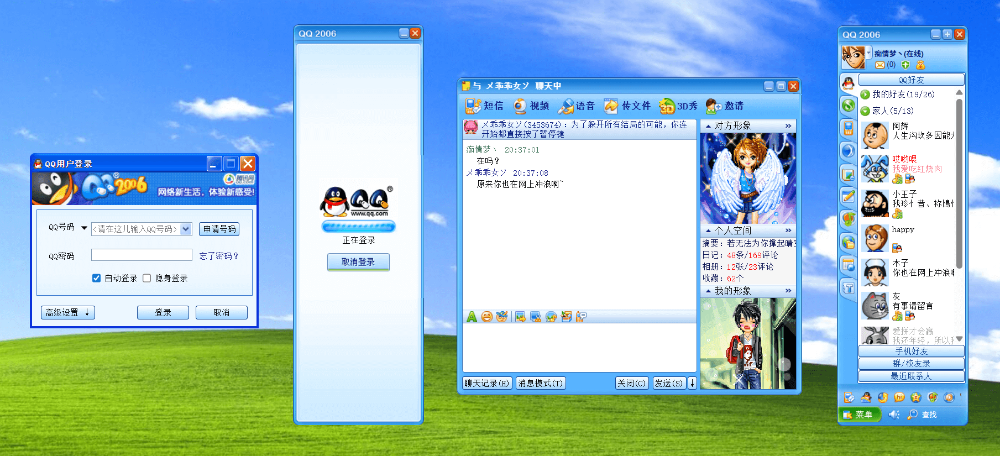

# QQ2006 HTML 复刻版

这是一个使用 HTML + CSS + JavaScript 实现的 QQ2006 像素级复刻项目，重现了80/90后网友的青春记忆——那个伴随我们成长的经典QQ界面！

从登录框的珊瑚蓝渐变，到主面板的好友头像，再到聊天窗口的功能图标，**所有素材全部从原版QQ2006安装包提取，力求还原最原始的体验**。

演示地址：https://lab.ur1.fun/QQ2006/

开源地址：https://github.com/mengkunsoft/QQ2006

作者主页：https://mkblog.cn/

### 🎯 为什么做这个？

**20年前**的 QQ2006，是很多80/90后的数字故乡。那时我们还说着“GG/MM”，攒钱买Q秀，为太阳等级熬夜挂机……这个项目不只是UI复刻，更是一次怀旧疗愈。

### 🌟 未来计划

- 增加更多交互逻辑，实现基础聊天功能模拟
- 复刻更多子功能界面，如菜单面板、视频聊天界面等

### ⚠️ 注意事项

- **仅供学习交流**，请勿用于商业用途
- **尊重版权**，所有素材均来自原版 QQ2006 安装包，版权归腾讯公司所有

### 🤝 贡献指南

如果你对这个项目感兴趣，想一起打造更完整的 QQ2006 复刻版，欢迎提交 PR 或 Issue。让我们一起为这段数字记忆添砖加瓦！

### 📜 开源许可

你可以自由地分享和修改代码，但请保留出处。

---

让我们一同重温那段青涩时光，用代码致敬经典！